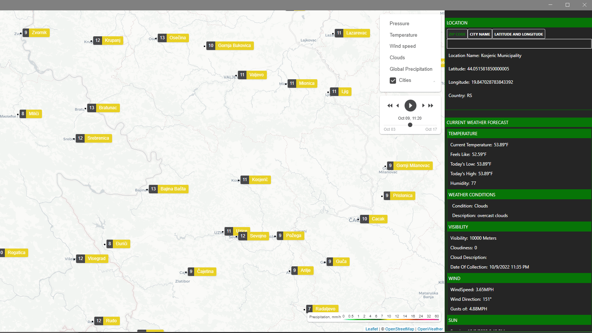

# OpenWeatherApp

## Requirements

### Visual C++ Runtime
* To run this application you will need the Visual C++ Runtime. It can be downloaded [here](https://aka.ms/vs/17/release/vc_redist.x64.exe)

### Windows
* The library, OpenWeatherApp, can be used cross-platform but the WPF application, OpenWeatherApp.Wpf.LiveMap can only be built and run on a Windows platform.

### .NET 6
*  This project is built on .NET 6
	* The .NET 6 SDKs can be found [here](https://dotnet.microsoft.com/en-us/download/dotnet/6.0)
		* The .NET 6 SDK includes the runtime but I currently can't the self-contained publishing to work with .NET 6 WPF so any deployments will need the runtime. 

## Overview
### CefSharp
*  This project uses CefSharp to embed a chrome browser to view the live tiles from [OpenWeather](https://openweathermap.org)
### OpenWeather API
* This project uses the open weather API to view live tiles and get the current forecast

## Preview
